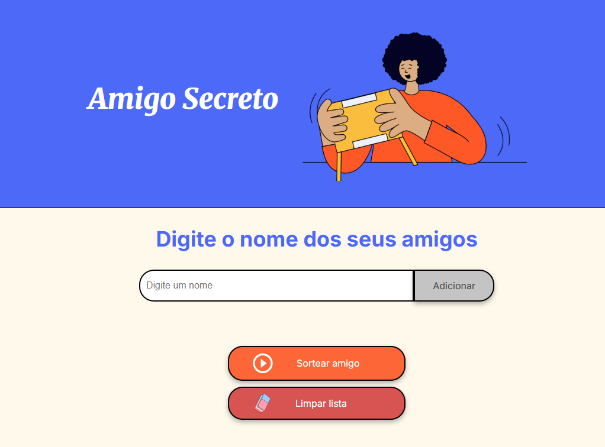

# 🎉 Projeto Amigo Secreto

Aplicação web para organizar e realizar sorteios de **Amigo Secreto** de forma prática, divertida e com um toque moderno.  
Ideal para amigos, familiares ou colegas de trabalho que querem manter a tradição sem complicação.  

---

## 📸 Imagem do projeto:


---

## 🚀 Destaques
- 📋 Gerencie facilmente a lista de participantes.  
- ➕ Adicione novos nomes com apenas um clique.  
- ➖ Remova pessoas que desistirem da brincadeira.  
- 🎲 Sorteio totalmente aleatório e justo.  
- 🎞️ Animação de suspense no momento do sorteio.  
- 📱 Layout responsivo, otimizado para celulares e desktops.  

---

## 🖥️ Tecnologias
Este projeto foi construído com:
- **HTML5** → estrutura semântica.  
- **CSS3** → estilos, animações e tema escuro.  
- **JavaScript (ES6+)** → regras do sorteio e manipulação da lista.  

---

## 📦 Instalação e Uso
1. Clone este repositório:
   ```bash
   git clone https://github.com/DanielTMagalhaes/Challenger-Amigo-Secreto-Oracle-One-DanielMagalhaes


## 👨‍💻 Autor
Desenvolvido por **Daniel T. Magalhães**
